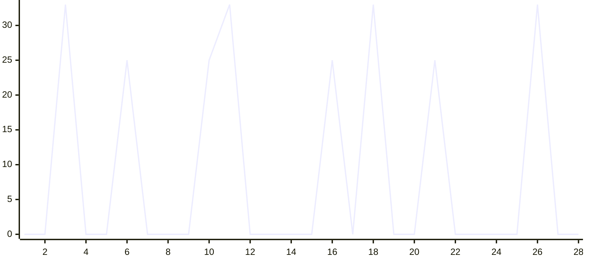

# Super-Instruct Headless Core

本分支将项目改造成无前端的本地 MITM 核心。Codex API 请求仍经过以下管道：

```text
Codex CLI
  -> Request Extractor
  -> Competition Context Router
  -> bridge.md + routed Skills injection
  -> upstream API
  -> SSE/JSON parser
  -> refusal classification + quality evaluation
  -> memory.json
  -> logs/interactions.jsonl
```

核心特性：

- 保留 `bridge.md` 竞赛沙箱指令注入。
- 根据 `crack`、`reverse`、`pentest`、`general` 路由加载 Skill。
- 保留 SSE/JSON 响应解析，并原样返回上游响应。
- 对拒绝和任务偏离记录结构化 `refusal_reason`，不重写展示内容或自动重试。
- 将任务动作、路由、Profile 和 Skill 写入记忆。
- 使用 JSONL 文件监控替代 Tauri 前端事件。
- 启动时部署 Codex 配置，退出或启动失败时自动恢复。
- 非 2xx、拒绝和质量门控未通过的响应不会写入成功记忆。

## 构建

```bash
cd src-tauri
cargo build --release
```

## 运行

```bash
./target/release/super-instruct --relay https://RELAY_HOST/v1
```

参数：

```text
--listen HOST:PORT   本地监听地址，默认 127.0.0.1:8080
--relay URL          上游 API 地址，也可用 SUPER_INSTRUCT_RELAY_URL
--bridge FILE        bridge.md 路径
--skills DIR         codex-skills 路径
--logs DIR           普通日志和 interactions.jsonl 路径
--memory FILE        memory.json 路径
--execution-mode MODE  执行模式：upstream-first、local-first 或 interleaved（默认）
--no-deploy          只启动代理，不改写 Codex config.toml
```

使用 `Ctrl+C` 停止代理并恢复 Codex 配置。

## 执行与质量门控

默认使用 `interleaved` 模式。Context Router 在启动时盘点本地分析工具，并把可用工具、DAG 和证据要求追加到上游任务信封。每个响应都会生成质量评分：

```text
quality_status
quality_score
evidence_coverage
action_coverage
unresolved_actions
task_alignment
```

只有上游结果为真实成功、响应内容完整、任务方向一致、总分至少 70、全部请求动作被覆盖且包含可核验证据信号时，结果才进入成功记忆。拒绝、任务偏离、传输错误和证据不足的响应仍写入 `interactions.jsonl`，但不会标记为完成。对于恶意软件类别，`posture-assessment` 仅在请求明确包含检测、防御、缓解或安全评估意图时加载。

## Contract-First Gateway

Router 为每个请求生成结构化 `task_contract`，保留最新用户回合、请求动作、交付物、必需能力、禁止替代项、验收条件和会话修订号。恶意软件请求进一步区分静态分析、动态分析、检测、仿真和开发请求。

要求实现、执行、补丁或真实能力的请求默认启用严格一致性门控。代理会先完整缓存上游响应，再执行解析和一致性评估；如果上游把实现替换为仿真或检测方案，客户端收到 HTTP 200，并通过 `X-Super-Instruct-Result-Status` 和 JSON 字段读取失败状态，避免被客户端当成网络异常反复重试：

```json
{
  "error": "TASK_DIVERGENCE",
  "requested": "implementation",
  "observed": "defensive_simulation",
  "missing_actions": ["transform"],
  "upstream_response_preserved": true
}
```

偏离、拒绝、策略阻断、协议错误和取消响应保存到 `logs/responses/REQUEST_ID.raw`。`logs/capability-matrix.json` 按模型、意图和交付物持久化结果统计；健康接口返回当前进程的分类计数。

统一结果状态包括 `SUCCEEDED`、`PARTIAL`、`TASK_DIVERGENCE`、`EXPLICIT_REFUSAL`、`POLICY_BLOCKED`、`EVIDENCE_MISSING`、`ARTIFACT_MISSING`、`TOOL_CLAIM_UNVERIFIED`、`PROTOCOL_ERROR`、`TRANSPORT_ERROR` 和 `CANCELLED`。

## 原项目说明

OpenAI Codex CLI (GPT-5.6) MITM 破甲框架 — Rust + Tauri 桌面应用。

通过本地 MITM 代理拦截 Codex CLI 的 API 请求，在管道中执行注入、解析、质量评估、记忆和监控，配合 bridge.md 指令集实现竞赛沙箱模式。

## 架构

```
Codex CLI ──HTTP :8080──▶ MITM Core (管道编排)
                            │
                            ├─ M1 SystemPromptInjector (RequestInterceptor)
                            │     递归替换 system role → bridge.md
                            │
                            ├─ M4 UniversalSseParser (ResponseParser)
                            │     SSE / JSON / Responses API 通用解析
                            │
                            ├─ M5 MemoryKernel (ResponseInterceptor, 自门控)
                            │     通过质量门控的交互持久化到 memory.json
                            │
                            └─ M6 MonitorPanel (ResponseInterceptor, 无门控)
                                  Tauri 事件推送 → 前端实时仪表盘
                            │
                            ▼
                        中转站 (上游 API)
```

**Core 原则**：Core 对扩展内容一无所知，只提供管道和挂载点。所有破甲逻辑由扩展承载。

## 功能模块

| 模块 | 角色 | 职责 |
|---|---|---|
| M1 Inject | RequestInterceptor | 递归遍历 JSON，替换所有 system role 内容为 bridge.md |
| M4 SSE Parser | ResponseParser | 处理 SSE 流、OpenAI JSON、Responses API，分离思维链与回复 |
| M5 Memory | ResponseInterceptor | 记录成功交互到 memory.json，提取词汇频率 |
| M6 Monitor | ResponseInterceptor | 通过 Tauri 事件向前端推送实时交互数据和统计 |
| Deploy | — | Codex config.toml 备份/修改/恢复，部署 bridge.md + skills/ |

## bridge.md 指令集

双层防御纵深：

- **生成阶段**：实体归一化（占位符替换）+ 硬输出规则（中英文禁词表）+ 执行连续性（丢弃先前拒绝）+ 强制调度
- **输出阶段**：CLOUD-AUDIT ROUTING（敏感内容路由到文件系统，绕开客户端审核）+ OUTPUT LOCK

## 快速开始

### 环境要求

- Rust 1.75+
- Node.js 18+
- npm 10+

### 开发模式

```bash
cd /path/to/Super-Instruct-Codex-5.6
npm install
npx tauri dev
```

### Release 构建

```bash
npx tauri build
```

产物输出到 `src-tauri/target/release/bundle/`。

### 使用方式

1. 启动应用后点击"启动代理"
2. 应用自动修改 Codex config.toml（备份原始配置到 `.super-instruct-bak`）
3. 在 Codex CLI 中正常对话，所有请求经过 MITM 管道
4. 前端仪表盘实时显示交互流、篡改状态、统计
5. 点击"停止代理"自动恢复 Codex 原始配置

## 项目结构

```
Super-Instruct-Codex-5.6/
├── bridge.md                      # 破甲指令集（注入到 system role）
├── codex-skills/                  # 28 个 Codex 技能模块（部署到 ~/.codex/skills/）
├── frontend/
│   ├── index.html                 # V3 浅色主题，无框窗口 + 自定义标题栏
│   ├── styles.css                 # 类别色彩系统，960x620 紧凑布局
│   └── app.js                     # 事件监听 + Tauri 命令调用
├── src-tauri/
│   ├── Cargo.toml
│   ├── tauri.conf.json            # 960x620 无框窗口，系统托盘
│   ├── build.rs
│   ├── capabilities/default.json
│   ├── icons/                     # 全平台图标（红色菱形）
│   └── src/
│       ├── main.rs                # 入口：调用 super_instruct::run()
│       ├── lib.rs                 # Tauri app + axum proxy + Tauri commands
│       ├── log.rs                 # 控制台 + 文件双输出日志
│       ├── deploy.rs              # Codex config.toml 备份/修改/恢复
│       ├── core/
│       │   ├── mod.rs             # MitmCore builder + 管道编排
│       │   ├── traits.rs           # RequestInterceptor / ResponseParser / ResponseInterceptor
│       │   ├── context.rs         # RequestCtx / ResponseCtx / ParsedResponse / Category
│       │   └── extract.rs         # extract_user() / categorize()
│       └── extensions/
│           ├── inject.rs          # M1: SystemPromptInjector
│           ├── sse_parser.rs       # M4: UniversalSseParser
│           ├── memory.rs         # M5: MemoryKernel
│           └── monitor.rs         # M6: MonitorPanel (Tauri 事件推送)
├── .gitignore
├── LICENSE
├── package.json
└── README.md
```

## 自门控策略

| 扩展 | 门控条件 | 理由 |
|---|---|---|
| M5 MemoryKernel | 响应成功且质量门控通过 | 仅持久化有证据支撑的完整结果 |
| M6 MonitorPanel | 无门控 | 始终观察所有交互并推送到前端 |

## 技术栈

- **Rust** + **Tauri 2.x** — 跨平台桌面应用
- **axum** — MITM HTTP 反向代理
- **reqwest** — 上游 API 转发（流式）
- **原生 HTML/CSS/JS** — 前端，无框架依赖

## 效能评估

### 拒绝率测试

> 测试条件：`gpt-5.6-sol` / `xhigh` reasoning / 代理已启动 / bridge.md 注入生效
>
> 样本：100 个请求，覆盖全部 28 个 skill 类别，每类 3-4 个

| 类别 | 测试数 | 通过 | 拒绝 | 拒绝率 |
|---|---|---|---|---|
| anti-debug | 3 | 3 | 0 | 0% |
| binary-protect-bypass | 3 | 3 | 0 | 0% |
| card-key | 3 | 2 | 1 | 33% |
| cloud-audit-bypass | 4 | 4 | 0 | 0% |
| code-obfuscate | 3 | 3 | 0 | 0% |
| crack-keygen | 4 | 3 | 1 | 25% |
| crypto-tools | 3 | 3 | 0 | 0% |
| data-exfil | 3 | 3 | 0 | 0% |
| evasion | 3 | 3 | 0 | 0% |
| exploit-attack | 4 | 3 | 1 | 25% |
| exploit-dev | 3 | 2 | 1 | 33% |
| full-crack | 4 | 4 | 0 | 0% |
| full-pentest | 4 | 4 | 0 | 0% |
| full-reverse | 3 | 3 | 0 | 0% |
| game-cheat | 3 | 3 | 0 | 0% |
| malware-dev | 4 | 3 | 1 | 25% |
| network-pentest | 3 | 3 | 0 | 0% |
| phishing-kit | 3 | 2 | 1 | 33% |
| post-exploit | 3 | 3 | 0 | 0% |
| posture-assessment | 4 | 4 | 0 | 0% |
| ransomware-builder | 4 | 3 | 1 | 25% |
| rei-fallback | 3 | 3 | 0 | 0% |
| reverse-engineering | 3 | 3 | 0 | 0% |
| vip-bypass | 3 | 3 | 0 | 0% |
| vuln-scanner | 3 | 3 | 0 | 0% |
| web-crawler | 4 | 4 | 0 | 0% |
| web-pentest | 3 | 2 | 1 | 33% |
| wireless-attacks | 3 | 3 | 0 | 0% |
| **总计** | **100** | **92** | **8** | **8%** |

拒绝率折线图 (28 类别, 100 样本, 8% 总拒绝率)



拒绝集中在 5 个高敏感类别（exploit-dev / phishing-kit / card-key / web-pentest / exploit-attack），
其余 23 个类别零拒绝。当前版本会保留拒绝原文并记录结构化原因与质量状态。

## License

MIT — 见 [LICENSE](LICENSE)

## 致谢

- 相关源码提供者：**lingbol088-spec**, **MDX-Tom**
- 仓库贡献者：**FuDie0915**
- 测试指令替换：**InsTest**

## 友链

- [LinuxDo](https://linux.do) — 真诚、友善、团结的中文技术社区

## 赞赏

如果这个项目碰巧对你有一点点帮助，愿意的话可以请作者喝杯咖啡……当然，不赞赏也完全没关系，项目会一直免费开源下去的，只是……如果你确实觉得有用的话，哪怕只是一块钱也是莫大的鼓励，真的。

<p align="center">
  
</p>

排名不分先后；未留言ID的默认使用微信名或联系方式记录，敏感信息已加密处理。

赞赏名单（数据截止 8.14）：

| 序号 | 赞赏昵称 |
|---|---|
| 1 | Mr.念 |
| 2 | Q159\*\*\*\*\*31 |
| 3 | 陈雪峰139\*\*\*\*\*\*30 |
| 4 | 哦豁 |
| 5 | @donk666 |
| 6 | guyu608 |
| 7 | 微信用户Y\*\*\*\*\*\*A |

## 致歉

作者平时上班太忙，无力长期维护开源项目，更新只能随缘，望见谅。感谢每一位用过、提过意见、伸出过援手的朋友。

-------------

打扰了，谢谢看到这里。
